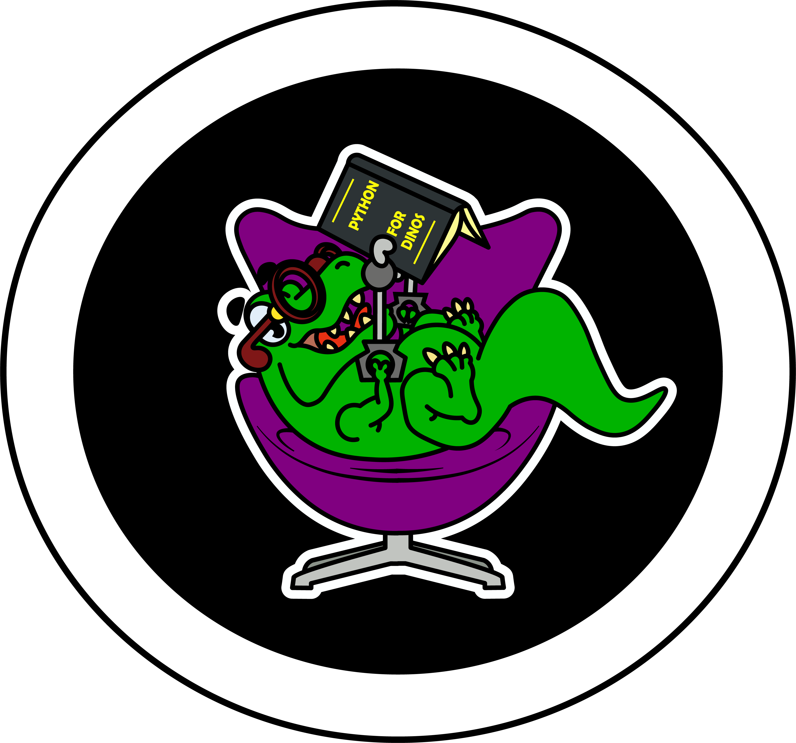

## ☻ Salve! Meu nome é Gabriel Pedroso ☻
  
  
  

  
  
  
   
  
 
    
 
         
      <h1 align="center">Tecnologias de conhecimento </h1>
      
      
      
      
      
      
      
     

